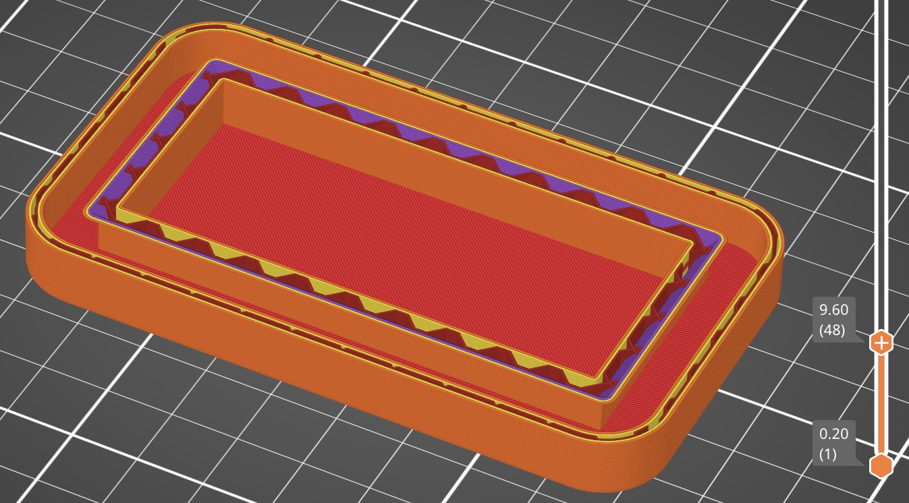
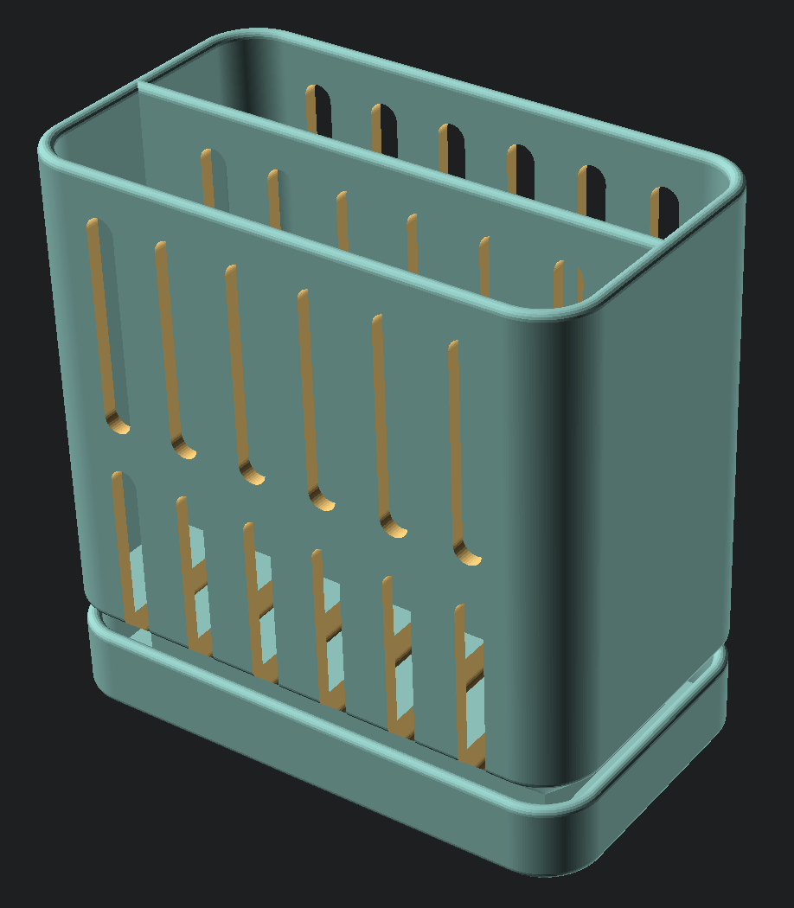

# Sponge Holder

This is a sponge holder for two standard kitchen sponges. Cutouts aid in drying the sponge, and an integrated dish catches drips. The model has a void in the based so weights can be added while printing to help prevent tipping.

|||
|-|-|
|||

# Printing

This model is designed to be printed on a standard consumer grade FDM printer with a 0.4mm nozzle. Any standard filament can be used, but PLA is recommended because it's low cost and handles overhangs well.

If you want to add weight when printing this model, add a pause step before before the top is added to the interior void:

During this pause, place the weights you plan to use inside the print, then resume. Wheel weights for cars are an inexpensive option.

# Models in this Project

|Image|Name|File|Description|
|-|-|-|-|
||`Sponge Holder`|`sponge holder.scad`|The sponge holder.|

# Dimensions

- The sponge slot interior is `80mm` x `92mm` x `24mm` (H x W x D).
- The holder itself is `98.5mm` x `97mm` x `55.5mm` (H x W x D).
- The bottom void for weights is `8.5mm` x `72mm` x `30.5mm` (H x W x D).

# Project Setup

Everything below this point is only relevant if you want to download this project and make edits.

## Cloning this Repository

This project uses a submodule for common SCAD code. If the submodule is not initialized, the `openscad-utilities` directory will be empty, and the project won't render.

To get the submodule code when cloning, add the `--recurse-submodules` option to the clone command. For example:
> `git clone [Project URL] --recurse-submodules`

If you've already cloned the project, run this command in the project root to pull down the submodule:
> `git submodule update --init`

## Exporting Model Files

There are two options for exporting the models:

1. Manually through the [OpenSCAD](https://openscad.org/) UI.
2. Through the provided export script.

As of 2024, the OpenSCAD development preview uses a new rendering engine called Manifold. Using the development preview with Manifold will render the models many times faster, regardless of how you export this project.

### 1. Exporting Manually

The `export map.scad` file contains an `if/else` condition where the call to generate each part can be seen. You can either write OpenSCAD code using these calls to build up a print plate, or the part "name" can be manually edited to select each part, which can then be rendered and exported through the OpenSCAD UI like any other project.

### 2. Exporting using the Script

The export script, `export.py`, depends on the [SCAD Export](https://github.com/CharlesLenk/scad_export) library. To use this script follow the instructions in the SCAD Export documentation.
